# RuoYi-Go-Plus

基于go语言gf框架开发的前后端分离接口，前端与 [plus-ui](https://github.com/JavaLionLi/plus-ui)、[ruoyi-plus-vben](https://gitee.com/dapppp/ruoyi-plus-vben)完全兼容，后端与[RuoYi-Vue-Plus](https://github.com/dromara/RuoYi-Vue-Plus)、[RuoYi-Cloud-Plus](https://github.com/dromara/RuoYi-Cloud-Plus)数据同步，生态共享！

---


## 接口如何运行？

> 暂时为了配合[ruoyi-plus-vben]([ruoyi-plus-vben](https://gitee.com/dapppp/ruoyi-plus-vben))更加简单高效的测试，给不会宿主机、docker、k8s部署的小白快速上手，故采用小型数据库sqlite，免部署绿色版运行！

### 1、下载程序到本地

```sh
git clone https://github.com/kshdb/RuoYi-Go-Plus.git
```


### 2、进入run目录

#### window 运行
```sh
cd run/
./RuoYi-Go-Plus.exe
```


或直接双击 RuoYi-Go-Plus.exe

#### Linux 运行

```sh
cd run/
chmod RuoYi-Go-Plus
./RuoYi-Go-Plus
```

#### macOS 运行

```sh
cp bin/darwin_amd64/RuoYi-Go-Plus run/
cd run/
chmod RuoYi-Go-Plus
./RuoYi-Go-Plus
```


---


## 后端运行预览图

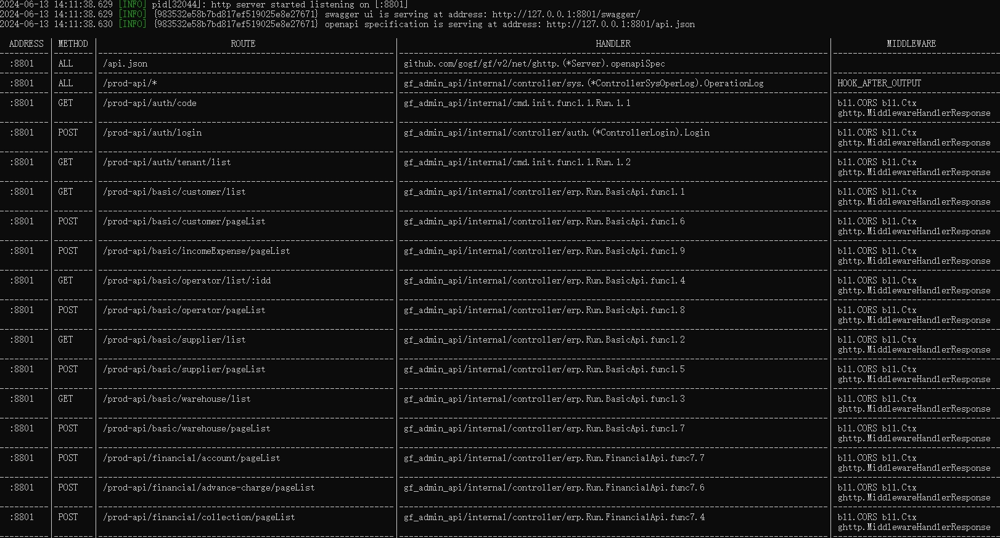


## 前端如何运行？
直接点击[ruoyi-plus-vben](https://gitee.com/dapppp/ruoyi-plus-vben),去下载前端，内附有详细说明！

## 前端运行预览图

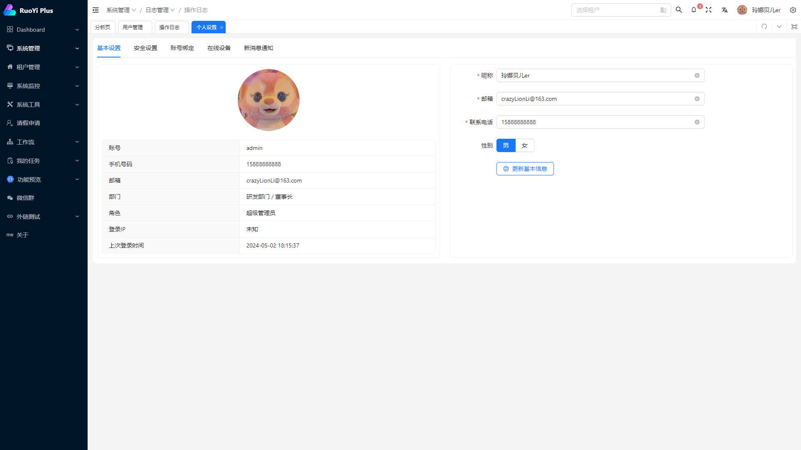
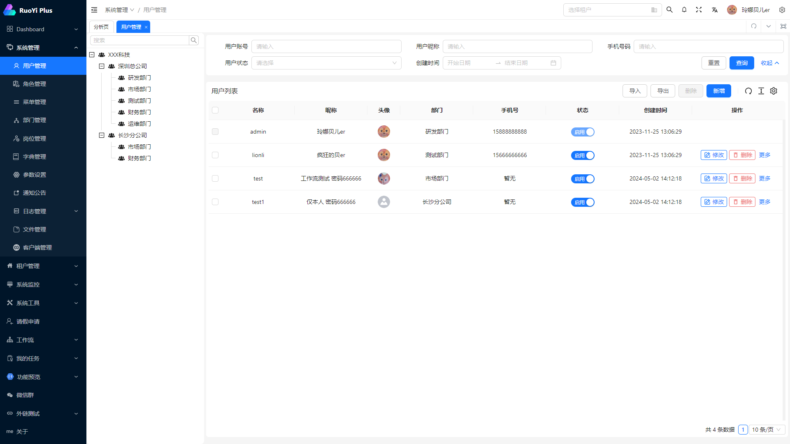
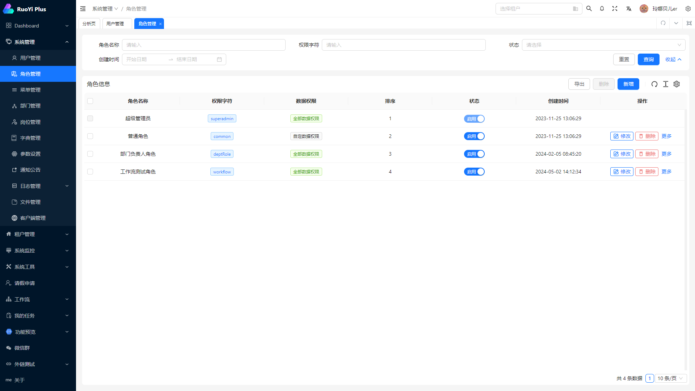
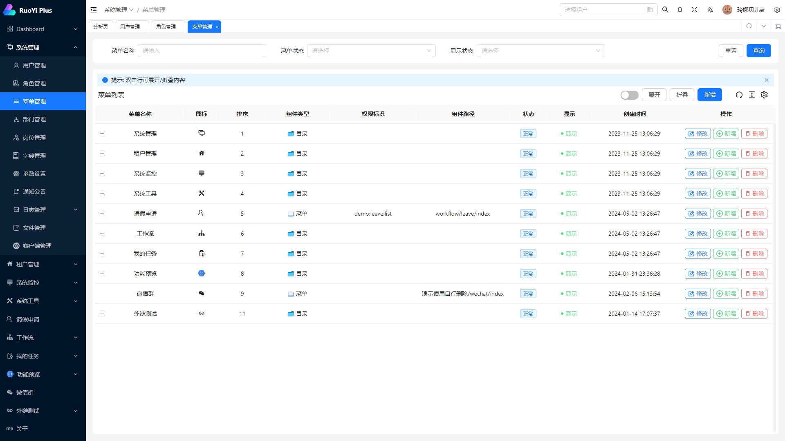
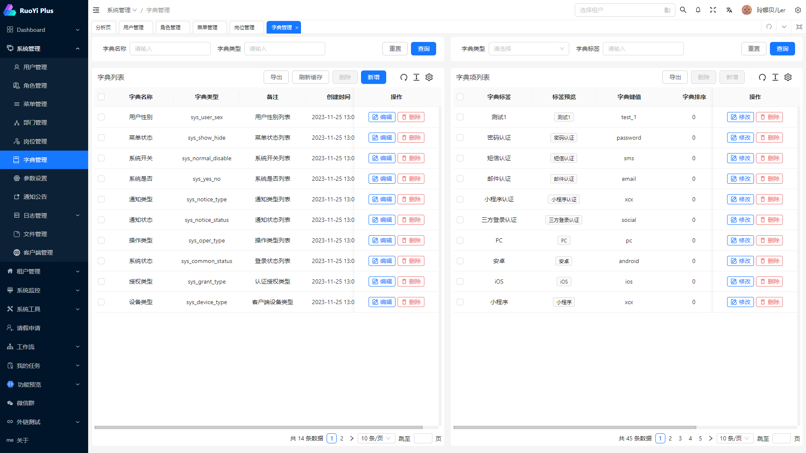
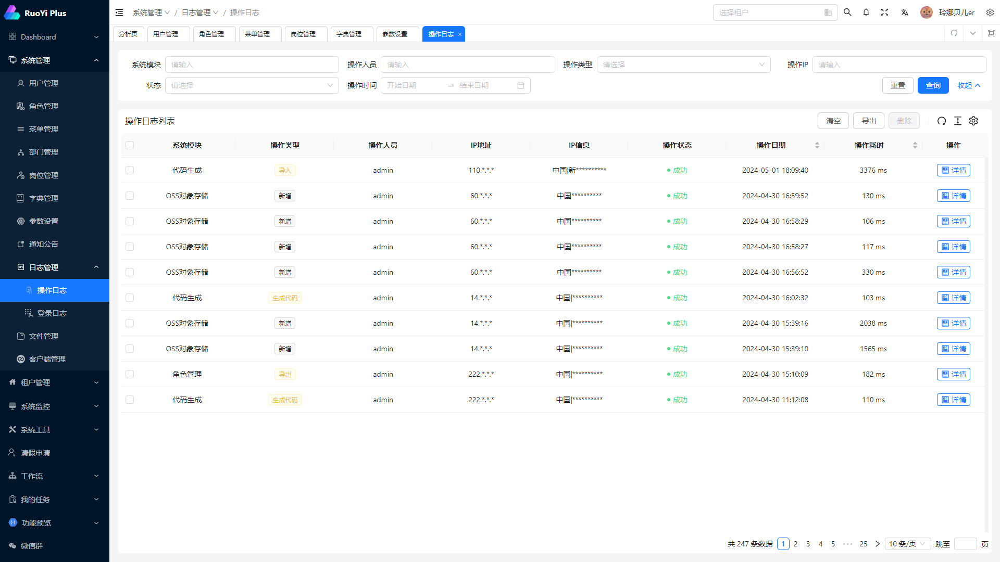
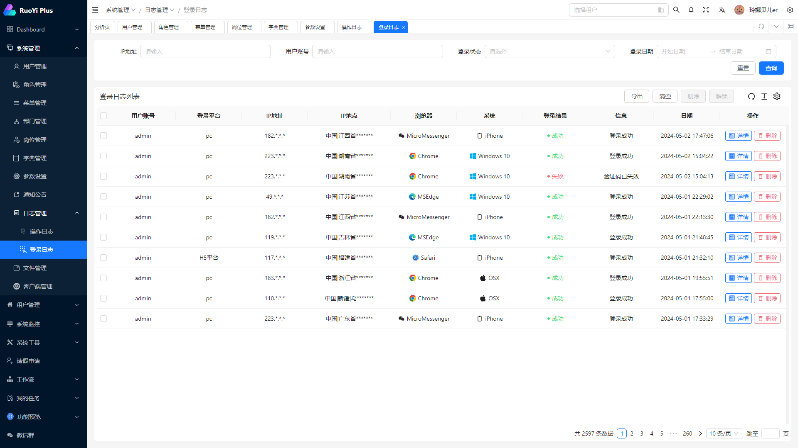
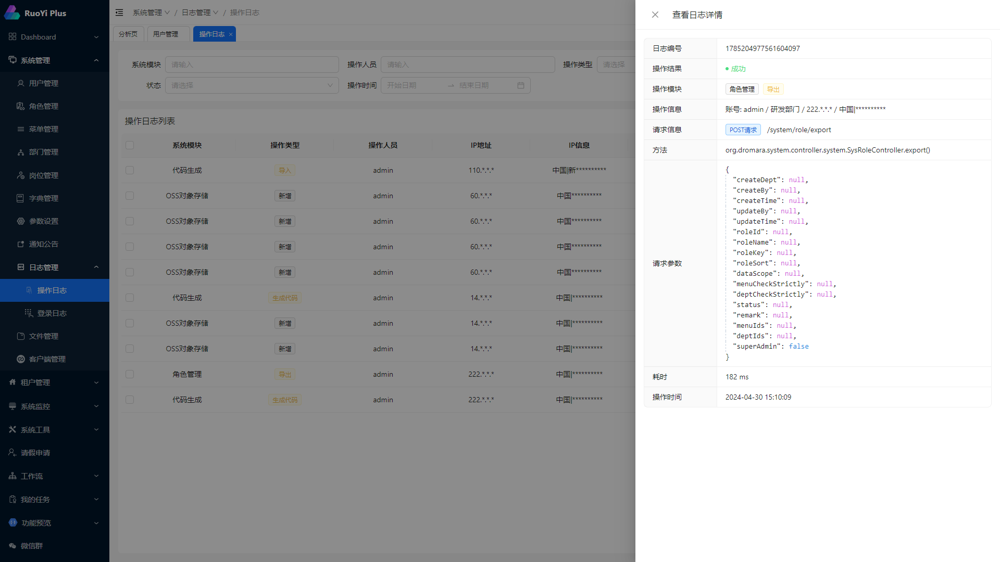
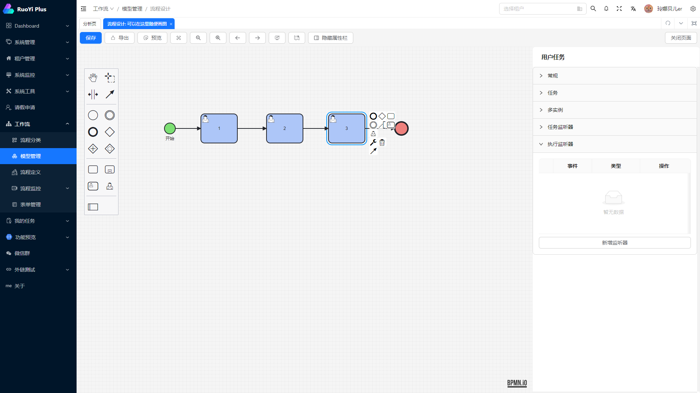
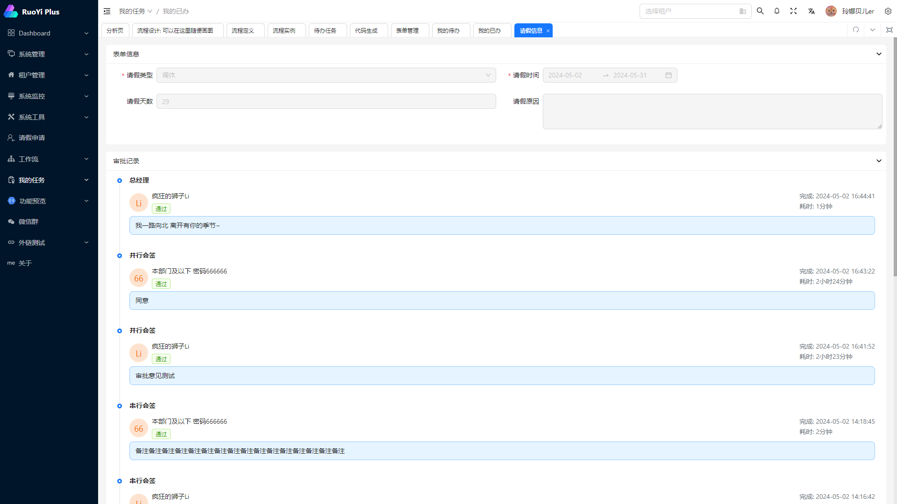

## 特别感谢

疯狂的狮子Li   玲娜贝er

## 特别说明

基于本人精力有限，暂不打算完全开源，先将各平台编译后的程序发布，可以接受拿来主义的白嫖，但不能接受拿起筷子吃肉放下筷子骂娘的态度！如果确实需要共享生态，可以加留言或加WX，拉入私有仓库共同维护！
